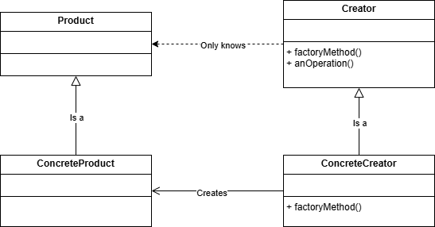

# Factory Method

The Factory Method Pattern defines an interface for creating an object, but lets subclasses decide which class to instantiate. Factory Method lets a class defer instantiation to subclasses.

Benefits:
- Encapsulation of Object Creation
- Extensibility: New ConcreteCreators and ConcreteProducts can be added
- Loose Coupling
- Open/Closed Principle: Add new ConcreteCreators and ConcreteProducts without modifying the actual Creator-class.